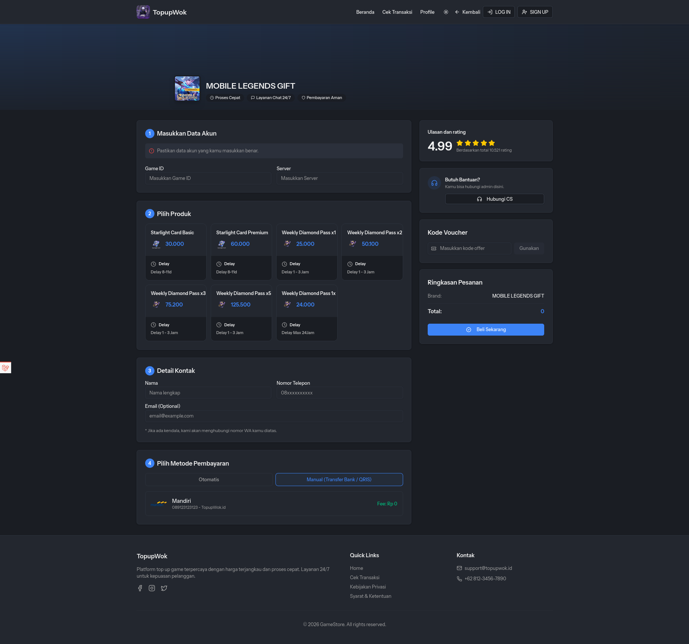

# Web PPOB

Web PPOB terintegrasi Digiflazz dan Midtrans untuk memudahkan pengguna dalam melakukan pembelian produk digital seperti pulsa, paket data, token listrik, dan lain-lain. Aplikasi ini menyediakan berbagai fitur untuk mengelola produk, transaksi, dan pengguna dengan mudah melalui panel admin yang intuitif.



- [x] Category, Brand, Product PPOB Management
- [x] Role-Based Access Control
- [x] Slider Management
- [x] FAQ Management
- [x] Checkout Flow
- [x] Payment Flow
- [x] Transaction History
- [x] Transaction Status Tracking
- [x] User Profile Management
- [x] Topup Saldo Management
- [x] Reporting and Analytics
- [x] Notification System
- [x] Manual Topup Digiflazz from Admin Panel
- [x] Manual Topup External from Admin Panel
- [x] Gift system flow

## Setup

1. Clone

```bash
git clone git@github.com:karuhun-developer/webtopup.git
```

2. Install dependencies

```bash
cd webtopup
composer install && npm install
```

3. Copy .env file

```bash
cp .env.example .env
```

4. Setup midtrans, digiflazz and apigames api credential in .env file

```bash
MIDTRANS_MERCHANT_ID=
MIDTRANS_SERVER_KEY=
MIDTRANS_CLIENT_KEY=

DIGIFLAZZ_USERNAME=
DIGIFLAZZ_API_KEY=
DIGIFLAZZ_WEBHOOK_SECRET=

APIAGAME_MERCHANT_ID=
APIAGAME_SECRET_KEY=
```

Untuk memudahkan setup credential, gunakan link berikut:

- Midtrans: https://midtrans.com
- Digiflazz: https://member.digiflazz.com/buyer-area
- API Games: https://member.apigames.id/pengaturan/secret-key

5. Generate application key

```bash
php artisan key:generate
```

6. Run database migrations and seeders

```bash
php artisan migrate --seed
```

7. Start the development server

```bash
php artisan serve
npm run dev
```

## Support this project

Saweria: https://saweria.co/warukunai
