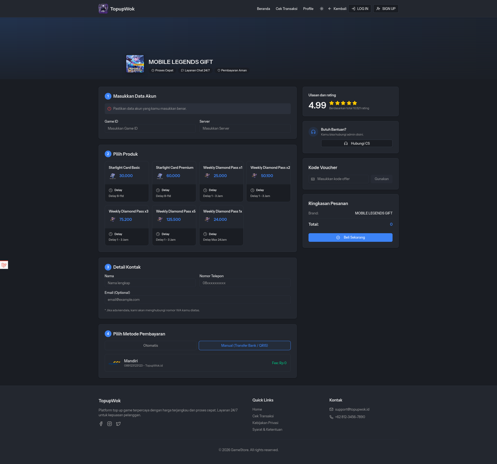

<div align="center">

# 🛒 Web PPOB

**Platform PPOB terintegrasi Digiflazz & Midtrans untuk pembelian produk digital**

[](https://laravel.com)
[](https://vuejs.org)
[](https://inertiajs.com)
[](https://tailwindcss.com)
[](https://docker.com)

[**Live Demo →**](https://topup.karuhundeveloper.com)



</div>

---

## ✨ Fitur

| Kategori      | Fitur                                                  |
| ------------- | ------------------------------------------------------ |
| **Produk**    | Manajemen Category, Brand & Product PPOB               |
| **Transaksi** | Checkout flow, Payment flow, Riwayat & Tracking status |
| **Pengguna**  | Role-Based Access Control, Manajemen profil            |
| **Konten**    | Manajemen Slider & FAQ                                 |
| **Lainnya**   | Reporting & Analytics, Notifikasi, Sistem Gift         |

---

## 🚀 Quick Start

### Opsi 1 — Docker (Direkomendasikan)

Cara paling mudah untuk menjalankan project secara lokal tanpa perlu setup PHP, MySQL, atau Redis secara manual.

**Prasyarat:** Docker & Docker Compose terinstall.

```bash
# 1. Clone repository
git clone git@github.com:karuhun-developer/webtopup.git
cd webtopup

# 2. Salin file environment
cp .env.docker .env

# 3. Setup otomatis (build image, migrate, generate key)
./docker-run.sh setup
```

Aplikasi berjalan di **http://localhost**

#### Perintah Docker yang Tersedia

```bash
./docker-run.sh setup       # Setup otomatis (copy .env.docker, build, migrate)
./docker-run.sh up          # Mulai semua service
./docker-run.sh dev         # Mulai + Vite dev server (profile dev)
./docker-run.sh down        # Hentikan semua service
./docker-run.sh shell       # Masuk ke bash container app
./docker-run.sh build       # Build ulang image Docker
./docker-run.sh artisan ... # Jalankan perintah Artisan
./docker-run.sh logs        # Tail log semua container
./docker-run.sh test        # Jalankan Pest tests
./docker-run.sh reset       # Reset semua data (hapus volumes)
```

#### Service Docker

| Service     | Image             | Port                                   |
| ----------- | ----------------- | -------------------------------------- |
| `app`       | PHP 8.4-FPM       | —                                      |
| `nginx`     | nginx:1.27-alpine | `80` (`APP_PORT`)                      |
| `db`        | mysql:8.4         | internal only                          |
| `redis`     | redis:7.4-alpine  | internal only                          |
| `queue`     | PHP 8.4-FPM       | —                                      |
| `scheduler` | PHP 8.4-FPM       | —                                      |
| `vite`      | node:22-alpine    | `5173` (only with `--profile dev`)     |

---

### Opsi 2 — Manual

**Prasyarat:** PHP 8.4, MySQL 8, Redis, Node.js 22, Composer.

```bash
# 1. Clone repository
git clone git@github.com:karuhun-developer/webtopup.git
cd webtopup

# 2. Install dependencies
composer install && npm install

# 3. Salin file environment
cp .env.example .env

# 4. Generate application key
php artisan key:generate

# 5. Sesuaikan konfigurasi database di .env, lalu jalankan migrasi
php artisan migrate --seed

# 6. Buat symlink storage
php artisan storage:link

# 7. Jalankan development server
composer run dev
```

---

## 🔑 Konfigurasi API

Isi kredensial berikut di file `.env`:

```env
# Midtrans — https://midtrans.com
MIDTRANS_MERCHANT_ID=
MIDTRANS_SERVER_KEY=
MIDTRANS_CLIENT_KEY=

# Digiflazz — https://member.digiflazz.com/buyer-area
DIGIFLAZZ_USERNAME=
DIGIFLAZZ_API_KEY=
DIGIFLAZZ_WEBHOOK_SECRET=

# API Games — https://member.apigames.id/pengaturan/secret-key
APIAGAME_MERCHANT_ID=
APIAGAME_SECRET_KEY=
```

---

## 🛠 Tech Stack

- **Backend:** Laravel 12, PHP 8.4
- **Frontend:** Vue 3, Inertia.js v2, TailwindCSS v4
- **Database:** MySQL 8
- **Cache / Queue:** Redis
- **Web Server:** Nginx
- **Auth:** Laravel Fortify + Sanctum
- **Media:** Spatie Media Library
- **Payment:** Midtrans
- **Supplier:** Digiflazz, API Games

---

## ☁️ Deploy ke Coolify

Image produksi tersedia di `Dockerfile.prod` (satu container: Nginx + PHP-FPM + queue worker + scheduler via Supervisor).

1. **Buat resource** di Coolify: `+ New` → **Application** → hubungkan repo GitHub ini, branch `master`.
2. **Build Pack** = `Dockerfile`, lalu set **Dockerfile Location** = `/Dockerfile.prod`.
3. **Ports Exposes** = `80`. Arahkan domain/FQDN ke port tersebut (SSL otomatis via proxy Coolify).
4. **Persistent Storage** — tambahkan volume untuk data upload & log agar tidak hilang saat redeploy:

   | Mount Path di container         | Keterangan                    |
   | ------------------------------- | ----------------------------- |
   | `/var/www/html/storage/app/public` | media (Spatie Media Library) |
   | `/var/www/html/storage/logs`       | log aplikasi                 |

5. **Environment Variables** — set minimal berikut di Coolify (jangan commit `.env`):

   ```env
   APP_NAME=WebTopup
   APP_ENV=production
   APP_DEBUG=false
   APP_URL=https://domain-kamu.com
   APP_KEY=base64:...          # php artisan key:generate --show
   APP_TIMEZONE=UTC
   APP_DISPLAY_TIMEZONE=Asia/Jakarta

   DB_CONNECTION=mysql
   DB_HOST=<host-db-coolify>
   DB_PORT=3306
   DB_DATABASE=webtopup
   DB_USERNAME=webtopup
   DB_PASSWORD=<password>

   REDIS_CLIENT=predis
   REDIS_HOST=<host-redis-coolify>
   REDIS_PORT=6379
   CACHE_STORE=redis
   QUEUE_CONNECTION=redis
   SESSION_DRIVER=redis

   PAYMENT_GATEWAY=midtrans
   MIDTRANS_MERCHANT_ID=
   MIDTRANS_SERVER_KEY=
   MIDTRANS_CLIENT_KEY=
   MIDTRANS_IS_PRODUCTION=true
   DIGIFLAZZ_USERNAME=
   DIGIFLAZZ_API_KEY=
   DIGIFLAZZ_WEBHOOK_SECRET=
   APIAGAME_MERCHANT_ID=
   APIAGAME_SECRET_KEY=
   GAME_PROXY_URL=
   ```

6. **Migrasi & seed** saat pertama kali: buka terminal container Coolify lalu `php artisan migrate --force --seed`, atau set env `RUN_MIGRATIONS=true` (entrypoint menjalankan migrate tiap boot) — sebaiknya gunakan Pre-deployment Command Coolify: `php artisan migrate --force && php artisan db:seed --class=PermissionSeeder --force`.
7. **Webhook** Midtrans/Digiflazz diarahkan ke `https://domain-kamu.com/api/v1/midtrans/callback` dan `/api/v1/digiflazz/callback`.

Catatan: queue worker & scheduler berjalan di dalam container yang sama. Untuk trafik tinggi, pisahkan menjadi service Coolify terpisah (`php artisan queue:work`, `php artisan schedule:work`).

---

## ❤️ Dukung Project Ini

Jika project ini bermanfaat, dukung pengembangan lebih lanjut:

**Saweria:** https://saweria.co/warukunai
